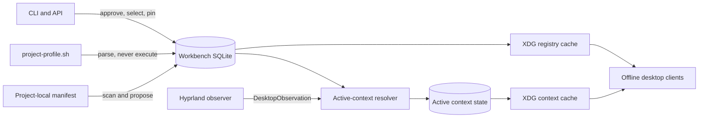
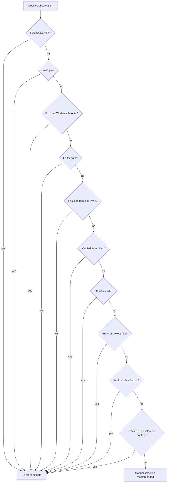

# Project registry and active context

This document describes the Phase 2 and Phase 3 control-plane implementation. SQLite in AI Workbench is authoritative; project-local files and desktop observations are inputs that require validation and, for configuration changes, explicit approval.

## Ownership



The desktop cache is deliberately minimal. It excludes workflow commands, environment references, secret references, prompts, clipboard contents and memory.

## Registry precedence

Highest to lowest:

1. Explicit manual override.
2. Persisted Workbench configuration.
3. Explicitly approved project-local manifest.
4. Imported legacy profile.
5. Safe automatic detection.

Project-local files never overwrite the canonical manifest. `project scan --apply` creates a pending proposal; a separate approval operation is required.

Supported local manifest filenames are `.ai-workbench-manifest.json` and `workbench.project.json`.

## CLI

```bash
ai project list
ai project import-legacy /path/to/project-profile.sh
ai project import-legacy /path/to/project-profile.sh --apply
ai project import manifest.json --project <project-id>
ai project import manifest.json --project <project-id> --apply
ai project scan [project-id]
ai project scan [project-id] --apply
ai project proposal approve <proposal-id>
ai project proposal reject <proposal-id>
ai project export <project-id> --output manifest.json
ai project pin <project-id> --scope persistent
ai project pin <project-id> --scope workspace
ai project pin <project-id> --scope session
ai project unpin
ai project backup /safe/path/workbench-backup.db
ai context status
ai context explain
```

Imports and scans are dry-run operations unless `--apply` is supplied. Apply creates proposals; it does not approve them.

`ai context status` falls back to the read-only XDG context cache when the API is unavailable and marks that output offline and stale.

## HTTP interfaces

| Method | Path | Purpose |
| --- | --- | --- |
| GET | `/registry` | List canonical manifests and selection |
| GET | `/registry/export` | Export versioned manifests |
| POST | `/registry/cache/refresh` | Atomically refresh desktop cache |
| GET | `/projects/:id/manifest` | Read canonical manifest |
| POST | `/projects/:id/manifest/proposals` | Validate and propose a manifest |
| GET | `/projects/:id/manifest/proposals` | List proposals by status |
| POST | `/registry/proposals/:id/approve` | Explicitly approve a proposal |
| POST | `/registry/proposals/:id/reject` | Explicitly reject a proposal |
| GET/POST/DELETE | `/context/selection` | Read, select/pin, or clear selection |
| POST | `/desktop/observations` | Ingest and resolve an observation |
| GET | `/context/status` | Read canonical active context |
| GET | `/context/explain` | Read winning and rejected evidence |
| GET | `/project-status` | Aggregate canonical project, Git, checks, work, services and runtime state |
| GET | `/project-status/compact` | Return and cache the compact desktop projection |

## Resolution order



Every candidate records evidence, confidence and rejection reason. A tmux candidate is ignored unless `associationVerified` is true. Workspace and session pins store anchor IDs and expire when an observation crosses the corresponding boundary.

Rofi, notifications, portals and other transient windows are marked by the observer and retain the previous project instead of causing focus flapping.

## Desktop observer

The observer is installed from the dotfiles repository:

```text
hypr/scripts/ai-workbench-observer
systemd/user/ai-workbench-desktop-observer.service
```

It subscribes to the Hyprland event socket through `socat`. It does not poll Git, Docker, models or Workbench. On a relevant focus/workspace event it:

1. Reads the focused Hyprland window once.
2. Reads the focused PID and, for terminals, selects a descendant shell from that focused process tree.
3. Correlates tmux only when a listed tmux client PID descends from the focused window PID.
4. Atomically writes an offline observation cache.
5. Posts the normalized observation with a one-second HTTP timeout.

Workbench downtime does not create divergent canonical state; only the observation cache is updated.

Enable after the dotfiles bootstrap links the unit:

```bash
systemctl --user daemon-reload
systemctl --user enable --now ai-workbench-desktop-observer.service
```

## Backup and recovery

`ai project backup` uses SQLite `VACUUM INTO`, opens the result read-only, runs `PRAGMA integrity_check`, records applied migrations and writes atomic metadata beside the backup. Model weights and regenerable indexes are not copied separately.

`ai project restore <backup>` validates and previews a restore without mutation. After every Workbench writer is stopped, `ai project restore <backup> --apply --confirm-stopped` automatically backs up the current destination, validates a temporary restored copy, atomically replaces the database and writes restore metadata. Restart Workbench and run `ai diagnose` after the replacement.

## Current compatibility boundary

Kage, Wayle, Rofi, project resume and scratchpads have not been switched to these contracts yet. The Phase 4 status aggregation is available and tested, but these desktop clients remain operational legacy consumers until Phase 5 parity and rollback checks pass. The observer is additive and may be disabled without affecting terminal fallback.

## Verification record

Phase 2 and Phase 3 were reverified on 2026-07-18 with the canonical registry, proposal/import, selection, pinning,
context precedence, tmux rejection, transient-window hysteresis, persistence, API, and cache tests. The focused suite
passed 20 tests. The complete Workbench fast suite passed 367 tests after lint and strict TypeScript checking. The
dotfiles shell/config guardrails and desktop adapter, canonical action, notification bridge, and workflow-launch tests
also passed.

This verifies the automated contract and compatibility boundary; it does not replace the still-required live
Hyprland latency and focus-correlation acceptance run described in `CONTINUATION_PLAN.md`.
