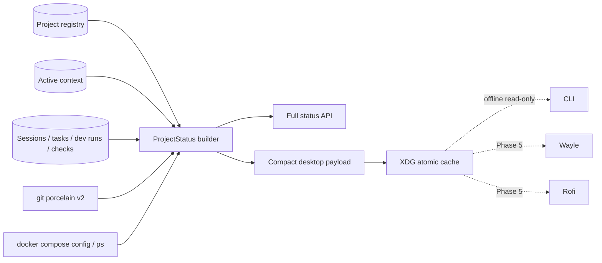

# Canonical project status

One project-scoped status aggregation path serves Workbench, CLI, Wayle, Rofi, Kage compatibility, and desktop
scripts. It composes canonical registry/context/work records with bounded Git, Docker Compose, and normalized runtime
health.

## Data flow



The cache is a projection, not a durable state owner. Canonical mutations still require Workbench. It contains no manifest commands, environment values, secret references, prompts, clipboard contents, or memory bodies.

## HTTP and CLI

| Interface | Purpose |
| --- | --- |
| `GET /project-status` | Full selected-project `ProjectStatus` |
| `GET /project-status?projectId=<id>` | Full explicit-project status |
| `GET /project-status/compact` | Compact desktop projection |
| `ai context status --json` | Selected-project status with offline fallback |
| `ai context status --compact` | Compact selected-project status with offline fallback |
| `ai project status <id>` | Explicit-project status |
| `ai project status <id> --compact` | Explicit compact status |
| `GET /actions?projectId=<id>` | Canonical approved actions with availability reasons |
| `POST /actions/<workflow-id>/run` | Policy-gated canonical workflow execution |
| `ai action list` / `ai action run <id>` | CLI action discovery and execution |

Successful selected/active-project requests atomically refresh
`${XDG_CACHE_HOME:-~/.cache}/ai-workbench/project-status-v1.json`. An explicit read for a background project returns
that status but cannot replace the singleton active desktop cache. The payload records `generatedAt` and a five-minute
fallback `staleAfter`; file/focus events normally refresh it sooner. CLI fallback explicitly wraps cached data with
`status: offline` and `stale: true`; it never fabricates a successful mutation.

The compact payload provides four stable presentation concepts for the Phase 5 Work cluster: project, Git/checks, active work, and AI/runtime. Its tooltip is newline-delimited human text rather than raw JSON.

## Git collection

Status runs:

```text
git status --porcelain=v2 --branch --show-stash --untracked-files=normal
```

The parser handles tracked worktree changes, staged changes, untracked-only repositories, deletions, renames, merge conflicts, detached and unborn heads, stashes, and ahead/behind counts. Commands use executable-plus-argument arrays with a five-second timeout; no shell interpolation is involved.

## Docker Compose collection

Service identity comes only from:

```text
docker compose [--file ...] [--profile ...] config --services
```

Runtime state comes from `docker compose ps --all --format json`. This keeps volumes and other top-level Compose keys out of the service list. Missing configuration, invalid configuration, stopped services, unhealthy services, and an inaccessible daemon are distinct results. Wayle must not call these commands independently.

## Package managers and actions

Explicit `ProjectManifest.packageManager` always wins. Bounded root-marker detection supports pnpm, npm, Yarn, Bun, Cargo, uv, Poetry, Gradle, Maven, Go, Make, and Just without repository-wide scanning.

Recommended actions are projected only from approved canonical manifest commands. The status layer does not invent
`npm run dev` or execute a command. Rofi uses this projection for labels and disabled reasons, while all mutation is
submitted back to Workbench. Direct, terminal, tmux, isolated, background, check-pipeline, and multi-step DAG modes
all use the shared policy/execution system; unavailable capabilities and unapproved mutation fail closed. See
[WORKFLOW_EXECUTION.md](./WORKFLOW_EXECUTION.md).

## Active work and check scoping

The status builder scopes sessions, tasks, development runs, and checks to the selected or explicitly requested project. It exposes the latest active task/run, task progress, branch, involved files, model profile, blockers, and resumability. Check aggregation uses the latest result per check name and does not leak results from another project.

The runtime section uses the normalized `RuntimeHealth` projection for API/database readiness plus worker, model
manager, embeddings, optional Qdrant, MCP, desktop bridge, and event-stream state. Optional offline components
degrade capabilities without making the canonical registry unavailable; an open port alone is never considered
readiness. Runtime probes are coalesced behind a five-second server-side snapshot so bursts of file events do not
repeat optional network probes.

## Verification

```bash
pnpm lint
pnpm typecheck
node --experimental-strip-types --test tests/project-status-collectors.test.ts tests/control-plane-api.test.ts
pnpm test:fast
```

The regression suite uses command-runner fakes for Docker isolation, parser fixtures for uncommon Git states, all package-manager markers, a real SQLite store for project scoping, contract validation, and an API/XDG-cache integration path.

## Compatibility boundary

The Phase 5 compatibility slice is implemented in the dotfiles repository: Wayle’s grouped Work chips, Kage status
output, the Rofi cockpit, project resume, AI helper context, and AI/log scratchpad launch prefer this compact cache.
Rofi can execute available canonical read-only workflows through the API; unavailable actions display their policy
reason. Kage’s legacy detector/cache remain an explicit offline rollback fallback until mutating/interactive workflow
parity and manual desktop checks pass.

`ActiveWork` also projects the newest active or recoverable canonical workflow execution through
`workflowExecutionId`, `workflowId`, and its snapshotted `recoveryWorkflowIds`. The compact cache therefore gives
Rofi and Wayle one source for task, development-run, approval, workflow, blocker, and recovery state. Rofi opens the
Workbench workflow review route or posts an allowed recovery to the canonical API; it never runs a cached recovery
command.
