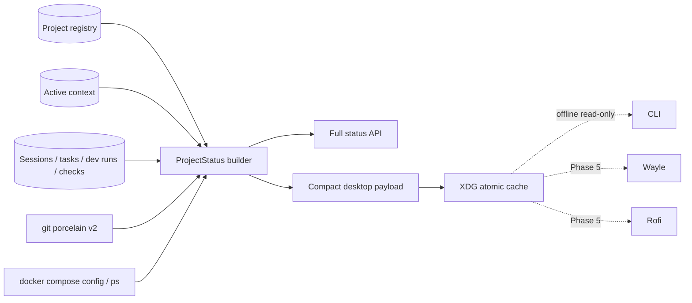

# Canonical project status

Phase 4 adds one project-scoped status aggregation path for Workbench, CLI, and future desktop consumers. It composes canonical registry/context/work records with bounded Git and Docker Compose probes. Wayle and Kage are not migrated in this phase.

## Data flow



The cache is a projection, not a durable state owner. Canonical mutations still require Workbench. It contains no manifest commands, environment values, secret references, prompts, clipboard contents, or memory bodies.

## HTTP and CLI

| Interface | Purpose |
| --- | --- |
| `GET /project-status` | Full selected-project `ProjectStatus` |
| `GET /project-status?projectId=<id>` | Full explicit-project status |
| `GET /project-status/compact` | Compact desktop projection |
| `ai context status --json` | Selected-project status with offline fallback |
| `ai context status --compact` | Compact selected-project status with offline fallback |
| `ai project status <id>` | Explicit-project status |
| `ai project status <id> --compact` | Explicit compact status |

Successful requests atomically refresh `${XDG_CACHE_HOME:-~/.cache}/ai-workbench/project-status-v1.json`. The payload records `generatedAt` and `staleAfter`. CLI fallback explicitly wraps cached data with `status: offline` and `stale: true`; it never fabricates a successful mutation.

The compact payload provides four stable presentation concepts for the Phase 5 Work cluster: project, Git/checks, active work, and AI/runtime. Its tooltip is newline-delimited human text rather than raw JSON.

## Git collection

Status runs:

```text
git status --porcelain=v2 --branch --show-stash --untracked-files=normal
```

The parser handles tracked worktree changes, staged changes, untracked-only repositories, deletions, renames, merge conflicts, detached and unborn heads, stashes, and ahead/behind counts. Commands use executable-plus-argument arrays with a five-second timeout; no shell interpolation is involved.

## Docker Compose collection

Service identity comes only from:

```text
docker compose [--file ...] [--profile ...] config --services
```

Runtime state comes from `docker compose ps --all --format json`. This keeps volumes and other top-level Compose keys out of the service list. Missing configuration, invalid configuration, stopped services, unhealthy services, and an inaccessible daemon are distinct results. Wayle must not call these commands independently.

## Package managers and actions

Explicit `ProjectManifest.packageManager` always wins. Bounded root-marker detection supports pnpm, npm, Yarn, Bun, Cargo, uv, Poetry, Gradle, Maven, Go, Make, and Just without repository-wide scanning.

Recommended actions are projected only from approved canonical manifest commands. The status layer does not invent `npm run dev` or execute a command. Execution remains behind the workflow policy and approval system.

## Active work and check scoping

The status builder scopes sessions, tasks, development runs, and checks to the selected or explicitly requested project. It exposes the latest active task/run, task progress, branch, involved files, model profile, blockers, and resumability. Check aggregation uses the latest result per check name and does not leak results from another project.

The runtime section currently proves Workbench API readiness only. Model manager, embeddings, Qdrant, index worker, MCP, and desktop-bridge readiness remain Phase 9 supervision work and must not be inferred from an open port.

## Verification

```bash
pnpm lint
pnpm typecheck
node --experimental-strip-types --test tests/project-status-collectors.test.ts tests/control-plane-api.test.ts
pnpm test:fast
```

The regression suite uses command-runner fakes for Docker isolation, parser fixtures for uncommon Git states, all package-manager markers, a real SQLite store for project scoping, contract validation, and an API/XDG-cache integration path.

## Compatibility boundary

The first Phase 5 compatibility slice is implemented in the dotfiles repository: Wayle’s grouped Work chips, Kage status output, the Rofi cockpit, project resume, AI helper context, and AI/log scratchpad launch prefer this compact cache. Kage’s legacy detector and cache remain available only as an explicit offline/rollback fallback. Canonical workflow execution and manual desktop parity checks must pass before those duplicated probes are retired.
