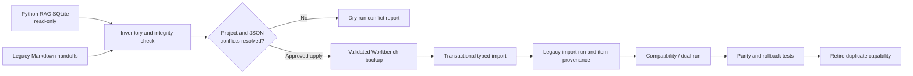

# Python RAG compatibility migration

The Python RAG database remains a supported compatibility source while the TypeScript Workbench becomes the durable owner. The migration never writes to the Python SQLite database, never executes Python code, and does not copy chunks, embeddings, Qdrant vectors, FTS tables, or retrieval caches. Those indexes are regenerated after canonical project matching.

## Current capability map

| Capability | Legacy source | Workbench destination | Current handling |
| --- | --- | --- | --- |
| Todos | `task_todos` | imported `agent_tasks` in a compatibility session | Import |
| Decisions | `task_decisions` | typed `memory_entries` | Import |
| Command memory | `command_memory` | `memory_entries(command_worked)` | Import |
| Error and test memory | `error_memory`, `test_failure_memory` | redacted memory entries | Import |
| Durable memory | `developer_memory`, `repo_memory` | project/global memory entries | Import |
| Sessions | `task_sessions` | completed imported agent sessions | Import |
| Session compaction | `session_compactions` | session-summary memory | Import |
| Memory candidates | `memory_candidates` | canonical memory candidates | Import |
| Lessons | `task_lessons` | canonical lessons | Import after JSON validation |
| Context packs and handoffs | tables and Markdown files | canonical context packs and handoffs | Import with bounded text, target and source provenance |
| Task graphs and outcomes | `task_runs`, `task_outcomes` | sessions, tasks, DAG edges and structured outcomes | Import after node, reference and cycle validation |
| Retrieval diagnostics | `retrieval_runs`, `retrieval_outcomes` | retrieval queries, feedback and misses | Import without fabricating chunk results |
| Retrieval evaluation | `eval_cases`, `eval_runs` | eval cases and typed evaluation memory | Import; aggregate runs remain summaries because they have no case IDs |
| Chunks, symbols, FTS, vectors | SQLite/Qdrant index data | Workbench index | Regenerate; never copy |
| Python MCP tools | Python MCP server | Workbench MCP | Dual-run until client parity passes |

The executable mapping is returned in every inventory report. Unsupported or semantically ambiguous tables remain visible as deferred data instead of being silently dropped.

## Migration stages



## Dry run

```bash
pnpm cli -- migration python-rag "$HOME/ai-rag/rag.sqlite3" \
  --rag-home "$HOME/ai-rag" \
  --output runtime/python-rag-dry-run.json
```

The report includes source integrity, applied Python migrations, table columns and counts, invalid documented JSON, canonical project matches, Markdown handoffs, import/reference/regenerate totals, and conflicts. An unmatched or ambiguous repository must be registered or explicitly resolved before its rows can be imported.

The live default location is `$HOME/ai-rag/rag.sqlite3`. At the time this migration was implemented, the local `$HOME/ai-rag` contained Qdrant storage but no SQLite database, so generated fixtures cover the importer until a real database is available for an operator-reviewed dry run.

## Apply

Review the dry-run JSON before applying:

```bash
pnpm cli -- migration python-rag "$HOME/ai-rag/rag.sqlite3" \
  --rag-home "$HOME/ai-rag" \
  --apply \
  --output runtime/python-rag-import.json
```

Apply mode always creates a consistent SQLite backup before opening a destination transaction. `--backup <path>` may choose the destination; otherwise a timestamped backup is placed beside the configured Workbench database. Backup integrity and migration versions are validated and recorded.

Every imported row receives:

- a stable destination ID derived from source database, table, source ID, and content hash;
- a `legacy_import_items` provenance row;
- the source reference and hash in memory evidence where the destination supports it;
- canonical project scoping when a single registry match exists;
- secret redaction before legacy text reaches canonical memory/session records.

Running the same source again reports exact rows as duplicates and does not create duplicate tasks, sessions, memories, candidates, lessons, context packs, handoffs, retrieval history or evaluation cases. Changed source rows have a new content hash and remain separately auditable.

Each row is imported behind a SQLite savepoint. Rows with unmatched projects, invalid JSON, malformed dependency references, dependency cycles or oversized handoffs are reported as conflicts, and a failed row cannot leave a partial graph or context pack. The original database is never changed.

Documented task graphs are capped at 256 subtasks, require unique IDs, validate every dependency, reject self-dependencies and cycles, and preserve task/outcome source IDs through stable provenance. Retrieval runs become canonical retrieval queries; legacy selected-file data remains in the query analysis rather than fabricating canonical chunk IDs.

## Backup, rollback, and recovery

Before apply, the CLI uses SQLite `VACUUM INTO`, validates `PRAGMA integrity_check`, records Workbench migrations, and writes backup metadata atomically.

Preview and perform a guarded restore with:

```bash
pnpm cli -- project restore runtime/pre-import.backup
pnpm cli -- project restore runtime/pre-import.backup --apply --confirm-stopped
```

The first command validates and previews only. Apply requires an explicit assertion that all Workbench writers are stopped, rejects symlink source/destination files, validates the source, creates another consistent backup of the current destination, validates a temporary restored copy, removes stale SQLite WAL/SHM sidecars, then atomically renames it into place and writes restore metadata.

To roll back:

1. Stop the Workbench API, worker, desktop observer, and any other SQLite writers.
2. Run the restore preview and inspect its migration list and destination.
3. Apply the guarded restore; its automatic pre-restore backup retains the current database as a forensic copy.
4. Start Workbench and run `ai diagnose`.
5. Confirm registry selection, sessions, memory, and event health before reconnecting desktop clients.

Do not delete the Python database, handoff files, or Qdrant storage during compatibility mode. The import report contains the exact backup path needed for rollback.

## Remaining parity gates

- Add a reviewed real-data dry run when a Python SQLite database is available.
- Link imported lessons to imported task outcomes where the legacy IDs provide unambiguous evidence.
- Decide whether historical `execution_runs` should map to dev runs or remain provenance-only; they are deliberately deferred today.
- Run client-level MCP parity tests before retiring Python MCP tools.
- Reindex imported projects and verify retrieval quality instead of copying legacy FTS/Qdrant data.
- Retire each duplicate capability only after its acceptance test and rollback drill passes.
