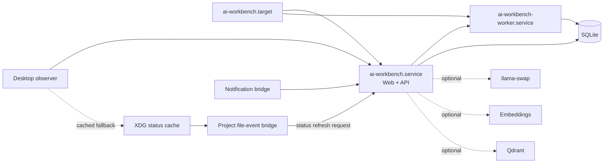

# Runtime supervision

AI Workbench has one central runtime configuration and a small systemd user-service graph. The supervised path is optional: desktop launchers retain the existing tmux terminal fallback when user services are unavailable.



## Ownership and readiness

`ai-workbench.service` runs the repository CLI's `web` command directly through `/usr/bin/node`. The service does not
depend on an interactive NVM or pnpm shell path. The current web server embeds the API, so there is deliberately no
second API service that could compete for port 4417. `ai-workbench-worker.service` starts after and requires that
control-plane process. The API unit also wants and orders the worker, so an API restart pulls a worker whose initial
dependency job failed back into the supervised graph instead of leaving it inactive.

The endpoints have different meanings:

- `GET /health` is the inexpensive legacy process/database snapshot.
- `GET /ready` is the core systemd readiness probe. It requires the API and canonical SQLite database only.
- `GET /runtime/health` returns the versioned `RuntimeHealth` contract for the API, database, worker, model manager, embeddings, Qdrant, MCP and desktop bridge.
- `GET /diagnostics` adds event-stream connection state and redacted recent failure summaries.
- `GET /health/deep` retains dependency diagnostics, but optional services no longer make its `ready` field false.

An offline model, embeddings server, desktop bridge or Qdrant degrades capability health without disabling registry, project context, sessions, CLI access, SQLite FTS, or cached desktop status.

## Central configuration

Copy `systemd/runtime.env.example` to `~/.config/ai-workbench/runtime.env`. Both the services and migrated desktop clients read that file. It is mode 0600 when installed and must contain only `KEY=value` entries. Keep secrets in their existing secret stores or referenced environment files; do not add secret values to the desktop cache.

The defaults are:

```text
Web        127.0.0.1:4317
API        127.0.0.1:4417
llama-swap 127.0.0.1:8080/v1
Embeddings 127.0.0.1:8081/v1
Qdrant     127.0.0.1:6333 (optional, disabled by default)
```

## Install, operate and inspect

Preview without changing user configuration:

```bash
./scripts/install-systemd-user.sh --dry-run
```

Install, then optionally enable startup:

```bash
./scripts/install-systemd-user.sh install
./scripts/install-systemd-user.sh install --enable
```

Operate and diagnose:

```bash
systemctl --user start ai-workbench.target
systemctl --user status ai-workbench.target ai-workbench.service ai-workbench-worker.service
journalctl --user -u ai-workbench.service -u ai-workbench-worker.service -f
curl -fsS http://127.0.0.1:4417/ready | jq
curl -fsS http://127.0.0.1:4417/runtime/health | jq
pnpm cli diagnose
./scripts/measure-runtime.sh
```

`measure-runtime.sh` is read-only. It samples `/ready`, compact project status, the canonical XDG status cache, and
the supervised API process. The JSON report includes median readiness/status/cache-read latency plus one-second
idle CPU and resident-memory samples when the systemd service is active. Stopped services and missing caches are
reported as offline/`null`, never as zero-latency successes. Set `AI_PERFORMANCE_SAMPLES` to adjust the default 25
requests.
For the tmux/terminal fallback, pass `AI_WORKBENCH_PID` to sample that API process instead of the systemd main PID.

Focus-to-context and Git-change-to-Wayle latency require a live Hyprland session and a real target repository. For
a release measurement, record timestamps before the event, wait for `desktop-observation-v1.json` and
`project-status-v1.json` generation times to advance, then invoke each `workbench-wayle-status` chip. Confirm that
the observer remains event-driven at idle, temporary windows do not flap context, and an unrelated tmux client is
listed as rejected evidence. Keep machine-specific results out of canonical defaults; attach them to the release or
migration report with CPU model, repository size, sample count, and Workbench revision.

The desktop launcher first asks systemd to start the target. If the target is not installed or cannot start, it stops the failed target and starts the established `ai-workbench` tmux scene instead.

Dotfiles separately provides graphical-session units for the Hyprland observation, active-project file-event, and
notification bridges. They reconnect independently and do not make the Workbench control plane depend on a running
desktop session. Use the narrow installer when only this service set should change; the general dotfiles bootstrap
also links the units but deliberately does not enable or start them:

```bash
cd /home/namik/Documents/code/dotfiles
./setup/install-workbench-desktop-services.sh --dry-run
./setup/install-workbench-desktop-services.sh install --enable
```

`ai-workbench-project-watch.service` reads only the canonical status cache to choose a registered project, watches
that canonical absolute path with bounded inotify subscriptions, prunes dependency/build/index trees, and requests
one debounced project-scoped status refresh from the loopback API. It never performs Git, Docker, project detection,
or a canonical mutation on the desktop side. Its default API endpoint is the same central `127.0.0.1:4417` contract
used by the other clients when `runtime.env` is absent.

## Rollback and uninstall

```bash
./scripts/install-systemd-user.sh uninstall
```

Uninstall stops and removes only the three known Workbench units. It preserves `~/.config/ai-workbench/runtime.env`, the SQLite database, caches and project data. The tmux launcher remains available immediately after rollback.

The graphical desktop bridges belong to dotfiles and are rolled back independently without deleting their caches
or runtime configuration:

```bash
cd /home/namik/Documents/code/dotfiles
./setup/install-workbench-desktop-services.sh uninstall
```

## Troubleshooting

- If `/ready` fails, inspect the Workbench journal and verify the database directory is writable.
- If `/ready` succeeds but `/runtime/health` is `stale`, inspect the specific component and blocker codes; core functionality is still available.
- A stale worker means its heartbeat is older than 15 seconds. Restart `ai-workbench-worker.service`.
- A stale desktop bridge means no focus observation arrived for 30 seconds. Check `ai-workbench-desktop-observer.service` and the Hyprland socket.
- If Git state updates only on the five-second fallback read, inspect `ai-workbench-project-watch.service`; confirm
  the status cache contains an absolute, canonical, non-symlink project path and check its structured journal.
- Qdrant being `unknown` while disabled is expected; retrieval falls back to SQLite FTS.
- The model manager can be `loading` while its models list is empty and becomes `ready` after at least one model is exposed.
