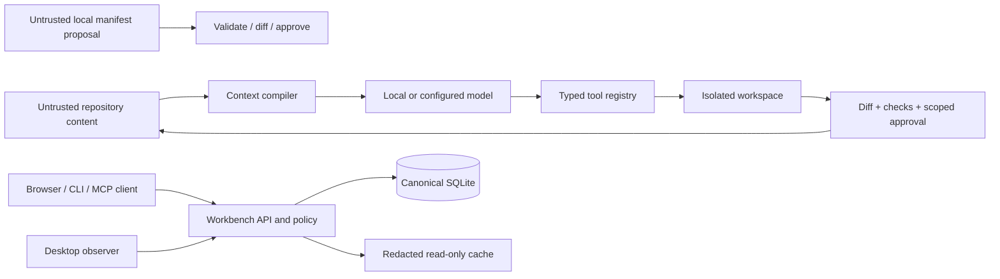
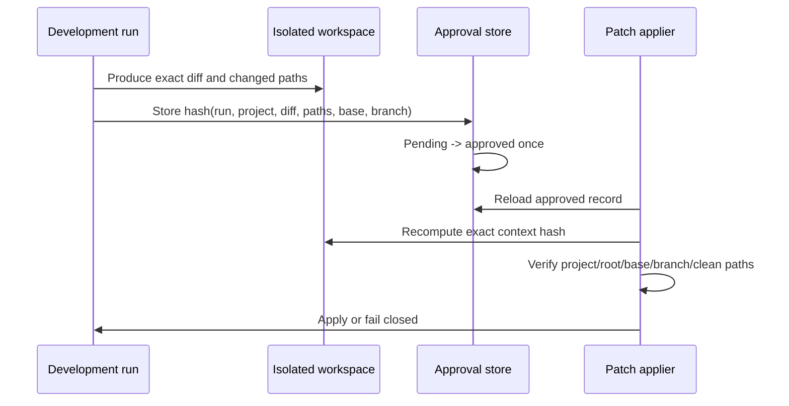

# Security threat model

Status: Phase 11 hardening baseline  
Date: 2026-07-18

The Workbench is a local control plane that can read repositories, compile model context, run approved workflows,
and apply reviewed changes. Local-only networking reduces exposure but does not make repository content, manifests,
MCP clients, clipboard data, or model output trusted. SQLite is the durable authority; desktop caches are read-only
projections and cannot authorize mutation.

## Trust boundaries



The approved project roots, canonical project/session/run IDs, typed arguments, and a fresh approval bound to an
exact reviewed context are security boundaries. A prompt, model response, project-local file, desktop observation,
or MCP request is evidence or input—not authority.

## Threats and controls

| Threat | Current controls | Verification | Remaining work |
|---|---|---|---|
| Malicious project-local manifest | Local manifests are parsed as versioned contracts, diffed into pending proposals, and require explicit approval before canonical import. Workflow execution uses structured executables/arguments, approved roots, mutation classification, and allowlists rather than evaluating manifest text as shell. | Manifest validation/precedence, proposal lifecycle, workflow policy, and command-policy tests. | Add a dedicated hostile-manifest fixture corpus as new manifest fields are introduced. |
| Repository prompt injection | Repository text is treated as retrieved source with provenance; it cannot grant tool permission or approval. File tools are typed, root-scoped, secret-filtered, and mutations stay in an isolated workspace until review. | Context-preview provenance tests, tool-policy tests, dev-agent approval tests. | Add explicit untrusted-source labels to every rendered context item and adversarial retrieval evaluations. |
| Shell argument injection | Canonical workflows separate executable and argument arrays, validate working directories, and reject denied binaries or unapproved commands. Imported legacy shell commands are non-executing compatibility data requiring a separate policy adapter. | Execution-engine allowlist and workflow tests. | Retire remaining legacy shell adapters only after structured workflow parity. |
| Secret leakage through workflow environment | Commands can request only names approved by both manifest `secretRefs` and command `environmentRefs`. The file provider requires current-user ownership and mode 0600, child output is value-redacted before persistence, and secret-bearing desktop handoffs are blocked. | Direct/background delivery, unapproved-reference, file-permission, API-response, and durable-audit redaction tests. | Add a protected desktop secret-delivery channel before terminal/tmux workflows can consume secret references. |
| Workflow DAG policy confusion or partial replay | DAGs reject duplicate, missing, self, and cyclic dependencies. Every referenced step must match the canonical command's execution mode and mutation class; the approval hash binds the complete ordered graph and command contexts. Failed dependencies block downstream steps, mutating retries are forbidden, and background restart recovery fails rather than replays a plan. | Contract graph, policy-mismatch, topological execution, aggregate approval, downstream blocking, background supervision, and cancellation regression tests. | Interactive DAG steps remain blocked until resumable token-bound desktop handoffs can preserve step identity and approval context. |
| Forged or replayed desktop workflow launch | Interactive launches are durable canonical records. A two-minute random capability is returned only after the workflow is ready; only its hash is stored. Start and completion callbacks are state- and token-bound, the capability file is mode 0600 and deleted on consumption, and the desktop helper executes argv without a shell. | Workflow launch contract/API replay tests and desktop launcher argument/permission/lifecycle tests. | Add authenticated desktop identity and a protected Unix-socket transport before supporting multi-user hosts. |
| Execution-mode downgrade, duplicate background side effect, or wrong checkout | Approved commands own their execution mode. Terminal/tmux presentation may be selected only for an approved desktop-launch command; isolated/background commands cannot be caller-downgraded. Isolated commands remap a canonical relative working directory into a retained Git worktree or safe copy. Background jobs revalidate the canonical manifest in the worker, track their process group, and fail rather than replay after supervisor restart. | Legacy mode normalization, invalid mode, downgrade rejection, isolated original-tree, durable background queue/cancellation, and restart-recovery regression tests. | Add namespace/container isolation for hostile build tools that can intentionally access paths outside their working directory. |
| Path traversal or symlink escape | Lexical containment, canonical `realpath` containment, ignored/secret path rules, and symlink-component rejection protect reads, writes, searches, workspace copies, and reviewed patch application. Apply also validates approved roots and project identity. | Escape, secret-file, repository-symlink, workspace-symlink, and target-symlink regression tests. | Linux filesystem races cannot be eliminated by preflight alone; use descriptor-relative/no-follow primitives if the process becomes multi-user or remotely exposed. |
| Malicious or confused MCP client | Tools have typed inputs, explicit read/mutate classification, project/session scoping, canonical lookups, audit records, and approval enforcement. Session ownership is loaded from SQLite rather than supplied by the caller. Workflow tools require an explicit project, proxy only the loopback canonical API, and cannot approve their own requests. | MCP scoping, audit, shared-session, workflow, and dev-run tests. | Add client authentication/capability grants before binding beyond loopback or a protected Unix socket. |
| Unsafe clipboard contents | Clipboard data is not included in desktop caches or structured logs and is not an implicit canonical source. | Cache/redaction tests and logging policy. | Explicit per-use clipboard consent and preview are not yet implemented; clipboard ingestion must remain disabled by default until they are. |
| Stale or replayed approval | An approval can transition from pending only once. Its SHA-256 context binding covers run, project, exact diff, sorted paths, base commit, and original branch. Approve and apply both recompute the binding; apply accepts only an approved run. | Approval bypass, stale-context, and duplicate-decision regressions. | Add expiry policy if approvals are allowed to remain pending across long-lived sessions. |
| Confused-deputy execution across projects | Project, run, workspace, approval, and session IDs are cross-checked. Workspace original root must match the canonical project path and remain under an approved root. | Cross-project session/run and approval tests. | Carry authenticated client identity into audit records once MCP client authentication exists. |
| Applying a patch to the wrong branch or changed checkout | Workspace records base commit and original branch. Apply refuses changed HEAD, changed branch, dirty reviewed target paths, project mismatch, stale approval, and symlink paths. | Branch-change, dirty-target, project-confusion, and approval-context tests. | A separately supervised apply worker would further reduce the API process privilege surface. |
| Secrets leaked through context, logs, or caches | Secret path patterns block reads; context envelopes are redacted; cache schemas exclude prompts, clipboard, commands, environment values, secret references, and memory bodies; structured runtime/notification logs use safe metadata. | Secret-file, context-redaction, cache-schema, and notification-policy tests. | Extend content-level secret scanning before external/cloud model routes are enabled; cloud remains disabled by default. |

## Approval binding



Approval is not a general permission to modify a repository. Any reviewed diff, path, base commit, branch, project,
or run change invalidates the approval. Failed validation must create a new review/approval cycle; it must never
fall back to an unscoped apply.

## Deployment assumptions

- API, MCP, model, and event endpoints remain loopback-only or use a protected local socket.
- Workbench runs as the desktop user, not root.
- Approved roots are explicit and canonicalized before mutation.
- Cloud providers remain disabled by default.
- Qdrant and local models are optional; their failure cannot relax policy.
- Backups are created before destructive migrations and restore requires writers to be stopped.

If an endpoint is exposed to another user, container, LAN, or remote client, the current local trust assumption no
longer holds. Authentication, per-client authorization, request limits, CSRF/origin policy, and stronger filesystem
isolation become release blockers.

## Security regression command

```bash
node --experimental-strip-types --test --test-concurrency=1 \
  tests/execution-engine.test.ts \
  tests/tools.test.ts \
  tests/dev-agent-e2e.test.ts \
  tests/mcp.test.ts \
  tests/context-compiler.test.ts
```

The full `pnpm typecheck`, `pnpm lint`, and `pnpm test:fast` suite remains required before release.
