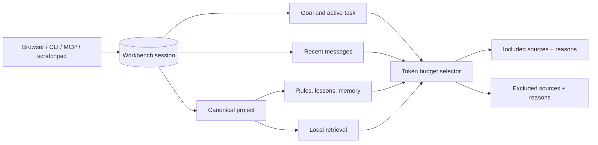

# Shared sessions and context preview

The Workbench SQLite database owns shared AI sessions and conversation messages. Browser, CLI, MCP, OpenCode,
Codex, and desktop scratchpads should carry a Workbench session ID instead of creating client-specific durable
conversation stores.

## HTTP contract

- `POST /sessions` creates a project-scoped session.
- `GET /sessions/:sessionId` resumes discovery of an existing session.
- `GET /sessions/:sessionId/messages` lists canonical conversation messages.
- `POST /sessions/:sessionId/messages` appends a `user`, `assistant`, or `agent` message. Public clients cannot inject
  `system` or `tool` messages.
- `POST /sessions/:sessionId/resume` reopens a paused or terminal session.
- `POST /sessions/:sessionId/close` completes or cancels a session and records its final summary.
- `GET /sessions/:sessionId/context` previews context selection. `query` and `tokenBudget` are optional.
- `POST /sessions/:sessionId/memory` saves an explicit result or outcome as durable project memory.

`POST /ask`, `POST /plan`, and `POST /dev/run` accept an optional `sessionId`. When supplied, the operation reuses
that canonical session. The API rejects missing sessions and cross-project reuse before retrieval, planning, or
execution begins.

The context preview is inspectable rather than opaque. It reports the reason and source for every included item,
token estimates, budget exclusions, selected files, index freshness, and retrieval-miss warnings. Sources include
the active file and selected symbol when desktop evidence is available, changed files, branch state, recent commits,
failed checks, the active run, the latest handoff, messages, project rules/lessons/memory, and retrieval results.
Duplicate content is excluded explicitly. Potential secrets are redacted from the complete response envelope,
including derived query and session summary fields. It does not claim that a local or Qdrant index is fresh when it
is unavailable.

## MCP tools

- `ai_create_session` — mutating, project-scoped
- `ai_append_session_message` — mutating, project inherited from the session
- `ai_resume_session` — mutating
- `ai_get_session_context` — read-only preview
- `ai_save_session_memory` — mutating, explicit outcome persistence

`ai_ask_rag`, `ai_create_plan`, and `ai_dev_start` also accept `sessionId`, allowing coding agents to preserve the
same project/task/conversation lineage through the full workflow.

MCP calls remain audit logged. Session IDs are the scoping boundary: message project ownership is copied from the
canonical session, never accepted from the caller.

## Browser and CLI continuity

Ask keeps the returned session ID for follow-up questions. From an answer, the user can preview context, save the
answer as memory, or open Planner with the same session. Planner can start Dev with that same ID and Dev continues
to enforce its existing isolated-workspace and approval policy.

The CLI supports `sessions create`, `show`, `append`, `context`, `resume`, `close`, and `memory`. `ask`, `plan`, and
`dev` accept `--session`. Canonical mutations require the Workbench API; an unavailable API fails clearly instead of
writing a divergent desktop-side session store.

## Context compilation

The compiler uses canonical SQLite retrieval with local FTS fallback and the existing project status/index metadata.
Remaining Phase 8 work includes richer explicit-file/clipboard consent, durable per-session retrieval-scope fields,
and dedicated session/handoff/retrieval deep-link presentations.
