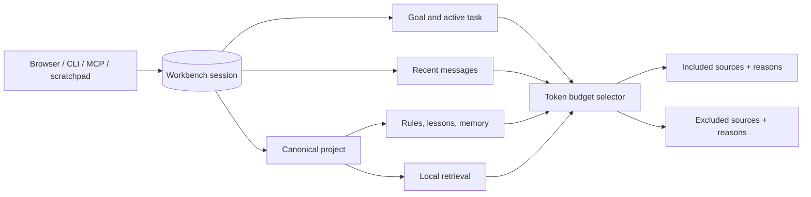

# Shared sessions and context preview

The Workbench SQLite database owns shared AI sessions and conversation messages. Browser, CLI, MCP, OpenCode,
Codex, and desktop scratchpads should carry a Workbench session ID instead of creating client-specific durable
conversation stores.

## HTTP contract

- `POST /sessions` creates a project-scoped session.
- `GET /sessions/:sessionId` resumes discovery of an existing session.
- `GET /sessions/:sessionId/messages` lists canonical conversation messages.
- `POST /sessions/:sessionId/messages` appends a `user`, `assistant`, or `agent` message. Public clients cannot inject
  `system` or `tool` messages.
- `POST /sessions/:sessionId/resume` reopens a paused or terminal session.
- `POST /sessions/:sessionId/close` completes or cancels a session and records its final summary.
- `GET /sessions/:sessionId/context` previews context selection. `query` and `tokenBudget` are optional.
- `GET /sessions/:sessionId/context/scope` reads the durable context policy.
- `PUT /sessions/:sessionId/context/scope` changes source flags, explicit/excluded paths, and the token ceiling.
- `POST /sessions/:sessionId/context/clipboard/preview` returns a redacted, non-persisted preview and source hash.
- `POST /sessions/:sessionId/context/consents` records an approved or denied one-use clipboard decision by hash.
- `POST /sessions/:sessionId/memory` saves an explicit result or outcome as durable project memory.

`POST /ask`, `POST /plan`, and `POST /dev/run` accept an optional `sessionId`. When supplied, the operation reuses
that canonical session. The API rejects missing sessions and cross-project reuse before retrieval, planning, or
execution begins.

The context preview is inspectable rather than opaque. It reports the reason and source for every included item,
token estimates, budget exclusions, selected files, index freshness, and retrieval-miss warnings. Sources include
the active file and selected symbol when desktop evidence is available, changed files, branch state, recent commits,
failed checks, the active run, the latest handoff, messages, project rules/lessons/memory, and retrieval results.
Duplicate content is excluded explicitly. Potential secrets are redacted from the complete response envelope,
including derived query and session summary fields. It does not claim that a local or Qdrant index is fresh when it
is unavailable.

The same durable scope is enforced at the Ask model boundary. Disabling retrieval, memory, rules, or conversation
removes that source from the packed prompt; excluded paths are filtered; approved explicit files are root-scoped,
secret-file checked, size limited, and redacted. The caller cannot raise an Ask above the session token ceiling.

Clipboard content is untrusted and opt-in. A project-scoped session must preview it, record an approval for the exact
SHA-256 source hash, and spend that approval on one Ask. A transaction prevents replay. Raw clipboard content and
the model response derived from it are ephemeral: durable prompts, context packs, model-call records, events,
messages, lessons, and caches contain only an omission marker/hash or safe summary. MCP deliberately has no tool to
self-approve clipboard data.

## MCP tools

- `ai_create_session` — mutating, project-scoped
- `ai_append_session_message` — mutating, project inherited from the session
- `ai_resume_session` — mutating
- `ai_get_session_context` — read-only preview
- `ai_get_session_context_scope` — read-only canonical policy
- `ai_save_session_memory` — mutating, explicit outcome persistence
- `ai_list_actions` / `ai_get_action_execution` — read-only, explicit-project workflow inspection
- `ai_run_action` / `ai_cancel_action` — mutating, API-owned workflow request and cancellation

`ai_ask_rag`, `ai_create_plan`, and `ai_dev_start` also accept `sessionId`, allowing coding agents to preserve the
same project/task/conversation lineage through the full workflow.

MCP calls remain audit logged. Session IDs are the scoping boundary: message project ownership is copied from the
canonical session, never accepted from the caller. Workflow tools require an explicit project ID and reject a session
or task owned by another project. They call the canonical loopback API and cannot approve their own workflow requests.

## Browser and CLI continuity

Ask keeps the returned session ID for follow-up questions. From an answer, the user can preview context, save the
answer as memory, or open Planner with the same session. Planner can start Dev with that same ID and Dev continues
to enforce its existing isolated-workspace and approval policy.

The CLI supports `sessions create`, `show`, `append`, `context`, `scope`, `resume`, `close`, and `memory`. Use
`sessions scope <id> --set` to change source flags, explicit/excluded paths, and token budget. `ask`, `plan`, and
`dev` accept `--session`. Canonical mutations require the Workbench API; an unavailable API fails clearly instead of
writing a divergent desktop-side session store.

## Context compilation

The compiler uses canonical SQLite retrieval with local FTS fallback and the existing project status/index metadata.
Remaining Phase 8 work includes dedicated handoff/retrieval deep-link presentations, clearer untrusted labels for
all repository-derived context, and broader adversarial repository prompt-injection evaluations.
