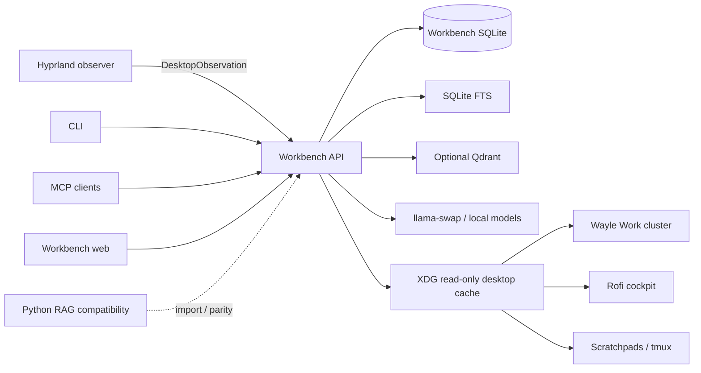
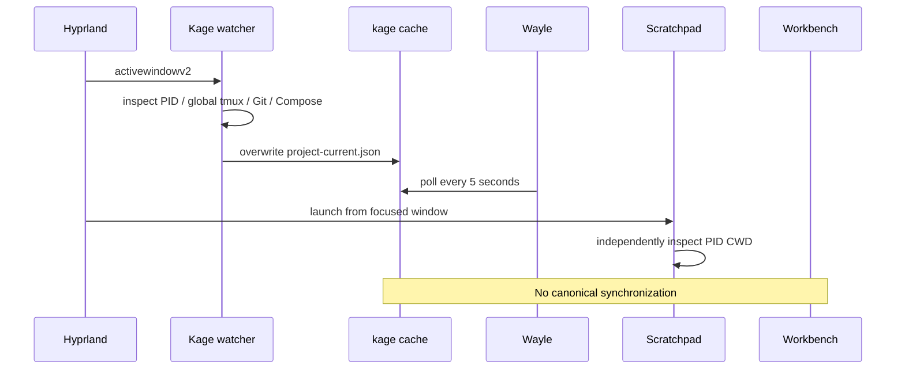
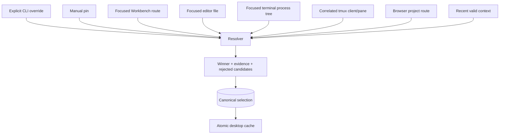
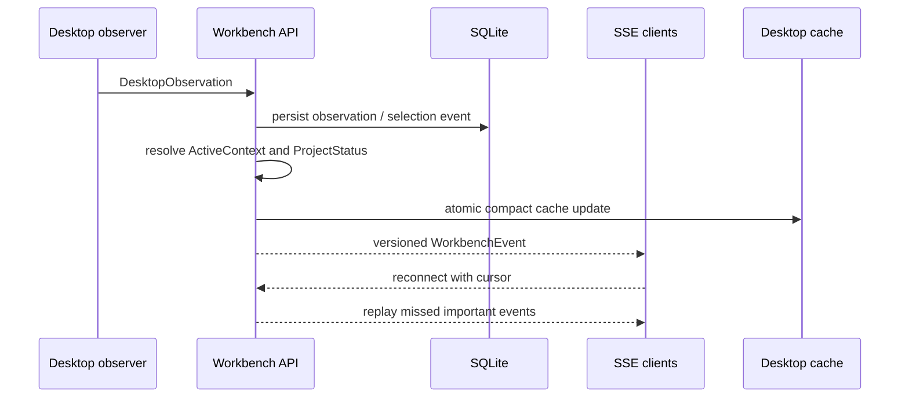

# Unified control plane baseline

Status: Phase 0 discovery and Phase 1 contract baseline  
Date: 2026-07-18

This document records verified ownership before the project-aware desktop migration. It is intentionally descriptive: no legacy owner may be removed until its destination has parity tests and rollback coverage.

## Product boundary

The TypeScript AI Workbench owns durable project, work, AI, retrieval, runtime, and event state in SQLite. Dotfiles owns Wayland observation and desktop presentation. Project-local configuration is importable/exportable configuration, not an independent database. Python RAG remains a compatibility source until its capabilities and data have migrated.



## State ownership and dependency map

| State or capability | Current durable source | Current consumers | Duplicate or gap | Canonical destination | Migration risk | Existing coverage |
|---|---|---|---|---|---|---|
| Project identity and paths | Workbench `projects`; shell `project-profile.sh`; Kage cache | Web, CLI, Kage, Wayle, Rofi, tmux | Three registries disagree | Workbench project manifest + registry tables | Path aliases and user-edited shell profiles | Workbench DB/API/project tests |
| Selected project | In-memory Zustand; focused-window shell inference | Web forms, Kage, scratchpads | Not durable or shared | Workbench selected/pinned project state | Focus flapping and wrong-project mutations | Web/store tests only |
| Focused desktop context | Kage watcher, scratchpad manager, `get-project-context.sh` | Wayle, AI prompts, runners | Competing resolution algorithms | `DesktopObservation` + canonical resolver | Unrelated global tmux pane can win | No focused resolver unit suite yet |
| Project commands | `project-profile.sh`, Kage shell cases, `.ai-workbench.json` checks | Rofi, tmux, dev agent | Hard-coded npm and project-specific duplication | Validated manifests + workflow policy | Malicious manifest / shell injection | Execution-engine and safety tests |
| Git status | Kage porcelain parsing; Workbench summary | Wayle and project pages | Kage misses untracked-only repositories and lacks ahead/behind/conflict detail | Aggregated `ProjectStatus.git` | Large repos and remote tracking absence | New contract fixture; parser tests still required in Phase 4 |
| Compose services | Kage indentation parser | Wayle tooltip and actions | Named volumes can appear as services | `docker compose config --services` adapter | Docker unavailable or malformed config | Phase 4 regression suite required |
| Tmux layouts/scenes | `project-profile.sh`, scratchpad registry | Project launch/resume | Project metadata is embedded in shell | Manifest desktop settings + workflow definitions | Preserving interactive sessions | Shell/manual coverage |
| Plans and tasks | Workbench sessions/tasks; Python RAG task graph | Web, CLI, MCP, Python agents | Different state models | Workbench active-work model and explicit transitions | Preserving Python outcomes/dependencies | Task/API/orchestrator tests in both repos |
| Dev runs/checks/approvals | Workbench SQLite | Web, CLI, MCP | Not visible to desktop | Workbench active-work/status aggregate | Stale approvals and wrong branch apply | Dev-agent and E2E tests |
| Reviews | Workbench SQLite | Web/API/CLI | Separate from live Wayle state | Workbench active-work/status aggregate | Linking review to run/task | Review tests |
| Sessions/handoffs | Workbench and Python RAG | Web, CLI, MCP, OpenCode | Clients can create separate histories | Shared Workbench sessions | Import conflicts and sensitive prompts | Session, trace, MCP tests |
| Memory/lessons | Workbench memory tables and Python RAG developer memory | Web, retrieval, agents | Two memory systems | Workbench SQLite with provenance | Duplicate/conflicting memories | Memory/reflection tests; importer absent |
| Retrieval/index state | Workbench SQLite/Qdrant and Python RAG | Ask, agents, web, MCP | Two indexes and stale-state semantics | Workbench with FTS baseline and optional Qdrant | Dimension/schema mismatch | Retrieval/index/eval tests |
| Model routing | Workbench model tables/config; llama-swap env/scripts | Workbench, OpenCode, scratchpads, Wayle | Status probes only a port/model list | `RuntimeHealth` + central runtime config | Model loading vs readiness ambiguity | Model runtime/health tests |
| Runtime health | Workbench `/health/deep`; shell port probes | Web, launcher, Wayle | No normalized desktop payload | `RuntimeHealth` contract and status cache | Partial outages | Health hardening tests |
| Events | Workbench events/SSE; shell notifications | Web live drawer, CLI logs | Existing envelope lacks schema/correlation/causation | Versioned `WorkbenchEvent` adapter | Event compatibility during rollout | SSE cursor/events/timeline tests |
| Todos/decisions/command/error memory | Python RAG SQLite | Python RAG CLI/agents | Missing or partial in Workbench | Import into typed Workbench memory/work records | Semantic loss | Python state tests; migration tests absent |

## Verified implementation boundaries

### Workbench

- Express REST API with modular routes and SSE.
- SQLite migrations through `packages/db/src/migrate.ts`.
- React/Vite browser UI with React Router and Zustand.
- Projects, sessions, tasks, plans, handoffs, retrieval, memory, models, checks, reviews, MCP and dev-run APIs.
- Isolated git-worktree/safe-copy development runs, allowlisted checks, approval records and patch application.
- SQLite FTS baseline with optional Qdrant.
- CLI and MCP surfaces that currently call Workbench code directly.

### Desktop

- Kage subscribes to Hyprland focus events and writes `~/.cache/kage/project-current.json`.
- Wayle polls Kage and llama-swap scripts independently.
- Scratchpads derive a process CWD and restart project-specific pads when their context changes.
- `project-profile.sh` contains the best current project-specific commands and tmux layouts.
- Workbench launcher starts `pnpm dev` in tmux and opens the fixed browser root.

### Python RAG compatibility

- Retain todos, decisions, command/error memory, task DAGs, context packs, handoffs, retrieval diagnostics, evals, outcomes and lessons.
- No Python table or runtime file is modified by Phase 1.

## Current data flow



## Phase 1 contracts

The initial versioned boundaries live in `packages/contracts/src`:

- `ProjectManifest`
- `ActiveContext`
- `ActiveWork`
- `RuntimeHealth`
- `ProjectStatus`
- `RecommendedAction`
- `WorkbenchEvent`
- `WorkflowDefinition`
- `WorkflowExecution`
- `DesktopObservation`

Every contract has:

- `schemaVersion: 1`
- stable `id`
- `createdAt` and `updatedAt`
- explicit `origin`
- capability flags
- strict nullability
- the shared state vocabulary
- a runtime parser and generated JSON Schema representation

Unversioned legacy payloads can be parsed as v1 only when their complete v1 structure is otherwise valid. Unknown future versions fail closed. Compatibility adapters must normalize old records before publishing them; clients must not guess at future schemas.

## Project selection target flow



The resolver must never query a globally active tmux pane without correlating it to the focused terminal PID/client.

## Event target flow



## Workflow safety target

```mermaid
flowchart LR
  Def[WorkflowDefinition] --> Validate[Schema + policy validation]
  Validate --> Resolve[Resolve executable and structured args]
  Resolve --> Scope[Canonical project-root check]
  Scope --> Risk[Mutation and secret classification]
  Risk -->|approval required| Approval[Fresh scoped approval]
  Risk -->|safe| Execute[Supervised execution]
  Approval --> Execute
  Execute --> Evidence[Structured output and artifacts]
  Evidence --> Event[WorkbenchEvent]
  Event --> Outcome[Task/run outcome and lesson]
```



Manifests describe commands as executable plus argument arrays. They are not shell scripts and do not bypass the existing tool, execution-engine or approval policy.

## Baseline verification

Run from `/home/namik/Documents/code/ai`:

```bash
pnpm typecheck
node --experimental-strip-types --test --test-concurrency=1 \
  tests/schema.test.ts tests/config.test.ts tests/migrations.test.ts tests/events.test.ts
pnpm lint
```

At discovery time:

- Typecheck passed.
- Focused schema/config/migration/event tests passed.
- Repository-wide Biome was already failing with 93 errors and 208 warnings, mainly existing formatting and import-order diagnostics. New contract files are checked independently and must remain clean.

## Migration backup procedure

Before the first registry or migration write:

1. Stop mutating Workbench jobs or put the worker into maintenance mode.
2. Record the Git revisions and `PRAGMA user_version`, migration list and integrity result.
3. Use SQLite `VACUUM INTO` or the SQLite backup API to create a transactionally consistent database copy.
4. Copy approved project-local `.ai-workbench.json` files separately with their project IDs and content hashes.
5. Export a redacted registry/manifests JSON snapshot.
6. Do not copy SQLite `-wal` and `-shm` files as an independent backup method.
7. Verify the copied database with `PRAGMA integrity_check` and open it with the current migration reader.
8. Store a migration log containing source path, destination path, schema versions, counts and hashes.

No destructive migration is authorized until an automated backup command and restore test implement this procedure in the registry phase.

## Phase 0 risks and compatibility constraints

- The dotfiles worktree was already dirty; existing user changes must not be overwritten.
- `setup/project-profile.sh` is currently user-modified and is an import source, not an edit target.
- Current Workbench project IDs may not equal desired stable manifest IDs.
- Project paths can be symlinks; canonical root and symlink-escape policy must be resolved before execution.
- Existing events must be adapted to `WorkbenchEvent`; replacing the envelope immediately would break web/SSE/MCP tests.
- Existing task/session/dev-run states use narrower enums. Adapters are required before persistence migration.
- The Python RAG database needs a dry-run inventory before any import.
- Qdrant remains optional and rebuildable; SQLite is the baseline.

## Next coherent slice

Phase 2 should add migrations and repositories for canonical manifests, selection/pins and import proposals, then expose import/diff/approve/export operations and an atomic XDG read-only cache. Wayle and Kage must remain unchanged until that status path is working and tested.
