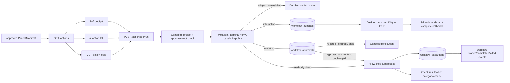

# Canonical workflow execution

Approved project manifests are the only desktop-visible source of project actions. The Workbench API owns policy,
execution state, logs, check projection, and events; Rofi and CLI are clients and never evaluate manifest commands.

## Current execution modes

Non-interactive read-only commands run directly under supervision. Project-write, destructive, and external commands
create a durable, expiring approval first. The approval is bound to the canonical project, complete structured command,
working directory, mutation class, branch, and base commit; changed review context invalidates it. Interactive commands
use a durable terminal/tmux launch handoff. Unresolved environment references and unavailable platform capabilities
still fail closed until their adapters exist.



Every accepted execution is inserted as `running`, or `waiting` when approval is required, before process launch and
updated to a terminal state afterward.
The durable record includes the structured executable/arguments, canonical working directory, bounded output,
duration, exit status, origin, and correlation ID. Ambient process secrets are excluded from the child environment;
only a small operating-system environment allowlist is inherited. Inline Node/Python evaluation and binaries outside
the explicit command allowlist are blocked.

## API and CLI

```text
GET  /actions?projectId=<id>
POST /actions/<workflow-id>/run
GET  /actions/executions/<execution-id>
POST /actions/executions/<execution-id>/approve
POST /actions/executions/<execution-id>/reject
POST /actions/executions/<execution-id>/cancel
POST /actions/executions/<execution-id>/launch/authorize
POST /actions/executions/<execution-id>/launch/start
POST /actions/executions/<execution-id>/launch/complete
GET  /approvals/<approval-id>

ai action list [--project <id>]
ai action run <workflow-id> [--project <id>] [--session <id>] [--task <id>]
ai action show <execution-id>
ai action approve <execution-id> [--notes <text>]
ai action reject <execution-id> [--notes <text>]
ai action cancel <execution-id>
```

Without `projectId`, action listing and execution use the canonical selected project. An unavailable API is a hard
failure for execution; desktop clients must not create a local workflow record or run a cached command. Rofi uses
the cached action label/state only for presentation and submits the stable workflow ID to Workbench.

## MCP boundary

Coding agents use `ai_list_actions`, `ai_get_action_execution`, `ai_run_action`, and `ai_cancel_action`. Every MCP
workflow call requires an explicit canonical `projectId`; execution requests additionally cross-check any session and
task against that project. These tools proxy the loopback Workbench API so MCP never becomes a second workflow runner.
Calls fail clearly when the API is unavailable, and every request remains in the MCP audit log.

There is intentionally no `ai_approve_action` tool. An agent may request a mutating workflow and receive its pending
approval/deep link, but it cannot approve its own request. Approval remains an independent user decision in Workbench
or through the explicit human-operated CLI.

## Interactive terminal and tmux handoff

An interactive manifest command never runs inside the API process. Workbench validates the same approved command,
working directory, mutation policy, project/session/task scope, and approval context, then persists a versioned
`WorkflowLaunch`. The execution becomes `ready` and emits `workflow.launch_ready`.

The desktop helper requests a two-minute, single-launch capability. SQLite stores only its SHA-256 hash. The helper
writes the capability to a mode-0600 file under the user runtime directory, launches Kitty or the manifest tmux
session with structured arguments, deletes the capability file when consumed, and executes the command without a
shell. It reports the child process group and final exit code through token-bound lifecycle callbacks. Replayed,
expired, wrong-state, and wrong-token callbacks are rejected. Canonical project/session/task identifiers are supplied
as environment variables; secret references and values are never part of the launch contract.

Rofi launches read-only interactive actions immediately. For an approved mutating interactive action, the event bridge
offers a `Launch` notification action after approval. Cancelling a ready launch closes it durably; cancelling a running
launch signals the reported process group and the helper records its terminal state.

## Adding a workflow

1. Add a structured command to a `ProjectManifest.commands` object. Use an executable plus argument array; never
   encode pipes, redirects, substitutions, or shell fragments.
2. Set the narrowest correct mutation classification. Never label a command read-only merely to bypass approval.
3. Set `interactive`, `workingDirectory`, timeout, environment references, capability requirements, and visibility
   conditions explicitly.
4. Import the project-local manifest as a proposal, review its diff, and approve it into canonical SQLite.
5. Confirm `ai action list --project <id>` shows the expected availability reason.
6. Run it once from CLI and inspect its execution/event record. For a mutating action, review the Workbench approval
   page and verify its project, branch, base commit, command, and working directory before approving.

Example:

```json
{
  "verify": {
    "id": "verify",
    "name": "Verify",
    "description": "Run the approved verification suite",
    "category": "check",
    "executable": "pnpm",
    "arguments": ["verify"],
    "workingDirectory": null,
    "environmentRefs": [],
    "interactive": false,
    "mutation": "read_only",
    "timeoutSeconds": 600,
    "requiresCapabilities": [],
    "visibleWhen": []
  }
}
```

Package scripts are trusted only after manifest approval and still run with reduced environment inheritance. For
strong enforcement against a misclassified package script, use an isolated workflow once the generic isolated
workflow adapter is complete.

## Remaining adapters

- background supervision, retry/dependency steps, restart recovery, and recovery workflows;
- safe secret-reference resolution without logging values;
- isolated generic workflows and artifact collection;
- platform capability discovery and `visibleWhen` evaluation.

Until each adapter has persistence and policy tests, the API returns an explicit blocked reason instead of silently
falling back to shell execution.
