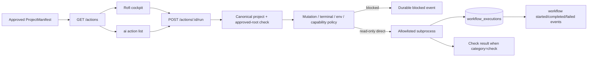

# Canonical workflow execution

Approved project manifests are the only desktop-visible source of project actions. The Workbench API owns policy,
execution state, logs, check projection, and events; Rofi and CLI are clients and never evaluate manifest commands.

## Current execution modes

The first complete slice supports approved, non-interactive, read-only commands through direct supervised execution.
It intentionally fails closed for project writes, destructive/external commands, interactive terminals, unresolved
environment references, and unavailable platform capabilities. Those modes require their approval, terminal/tmux,
or secret-reference adapters before they can run.



Every accepted execution is inserted as `running` before process launch and updated to a terminal state afterward.
The durable record includes the structured executable/arguments, canonical working directory, bounded output,
duration, exit status, origin, and correlation ID. Ambient process secrets are excluded from the child environment;
only a small operating-system environment allowlist is inherited. Inline Node/Python evaluation and binaries outside
the explicit command allowlist are blocked.

## API and CLI

```text
GET  /actions?projectId=<id>
POST /actions/<workflow-id>/run
GET  /actions/executions/<execution-id>

ai action list [--project <id>]
ai action run <workflow-id> [--project <id>] [--session <id>] [--task <id>]
```

Without `projectId`, action listing and execution use the canonical selected project. An unavailable API is a hard
failure for execution; desktop clients must not create a local workflow record or run a cached command. Rofi uses
the cached action label/state only for presentation and submits the stable workflow ID to Workbench.

## Adding a workflow

1. Add a structured command to a `ProjectManifest.commands` object. Use an executable plus argument array; never
   encode pipes, redirects, substitutions, or shell fragments.
2. Set the narrowest correct mutation classification. Never label a command read-only merely to bypass approval.
3. Set `interactive`, `workingDirectory`, timeout, environment references, capability requirements, and visibility
   conditions explicitly.
4. Import the project-local manifest as a proposal, review its diff, and approve it into canonical SQLite.
5. Confirm `ai action list --project <id>` shows the expected availability reason.
6. For a read-only direct action, run it once from CLI and inspect its execution/event record before exposing it in
   daily desktop use.

Example:

```json
{
  "verify": {
    "id": "verify",
    "name": "Verify",
    "description": "Run the approved verification suite",
    "category": "check",
    "executable": "pnpm",
    "arguments": ["verify"],
    "workingDirectory": null,
    "environmentRefs": [],
    "interactive": false,
    "mutation": "read_only",
    "timeoutSeconds": 600,
    "requiresCapabilities": [],
    "visibleWhen": []
  }
}
```

Package scripts are trusted only after manifest approval and still run with reduced environment inheritance. For
strong enforcement against a misclassified package script, use an isolated workflow once the generic isolated
workflow adapter is complete.

## Remaining adapters

- approval records scoped to mutating workflow definitions and exact arguments;
- floating Kitty and tmux execution with canonical context variables;
- background supervision, cancellation endpoint, retry/dependency steps, and recovery workflows;
- safe secret-reference resolution without logging values;
- isolated generic workflows and artifact collection;
- platform capability discovery and `visibleWhen` evaluation.

Until each adapter has persistence and policy tests, the API returns an explicit blocked reason instead of silently
falling back to shell execution.
