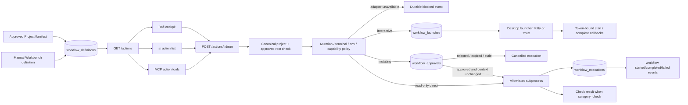

# Canonical workflow execution

SQLite workflow definitions are the canonical source of project actions. Approved manifest commands synchronize into
that registry transactionally, preserving manifests as import/export configuration rather than a competing runtime
database. Manual definitions take precedence and are not overwritten or deleted by later manifest synchronization;
existing databases are backfilled idempotently at startup. Definitions are available through
`GET /projects/:projectId/workflows` and matching-ID versioned definitions can be saved through `PUT`. Action listing
and execution consume this canonical layer. The Workbench API owns policy, execution state, logs, check projection,
and events; Rofi and CLI are clients and never evaluate manifest commands.

## Current execution modes

Non-interactive read-only commands run directly under supervision. Project-write, destructive, and external commands
create a durable, expiring approval first. The approval is bound to the canonical project, complete structured command,
working directory, mutation class, branch, and base commit; changed review context invalidates it. Interactive commands
use a durable terminal/tmux launch handoff. Secret references are resolved only for non-desktop modes; unavailable
platform capabilities and secret-bearing desktop launches fail closed until their adapters exist.



Every accepted execution is inserted as `running`, or `waiting` when approval is required, before process launch and
updated to a terminal state afterward.
The durable record includes the structured executable/arguments, canonical working directory, bounded output,
duration, exit status, origin, and correlation ID. Ambient process secrets are excluded from the child environment;
only a small operating-system environment allowlist is inherited. Inline Node/Python evaluation and binaries outside
the explicit command allowlist are blocked.

## API and CLI

```text
GET  /actions?projectId=<id>
POST /actions/<workflow-id>/run
GET  /actions/executions/<execution-id>
POST /actions/executions/<execution-id>/approve
POST /actions/executions/<execution-id>/reject
POST /actions/executions/<execution-id>/cancel
POST /actions/executions/<execution-id>/launch/authorize
POST /actions/executions/<execution-id>/launch/start
POST /actions/executions/<execution-id>/launch/complete
GET  /approvals/<approval-id>

ai action list [--project <id>]
ai action run <workflow-id> [--project <id>] [--session <id>] [--task <id>]
ai action show <execution-id>
ai action approve <execution-id> [--notes <text>]
ai action reject <execution-id> [--notes <text>]
ai action cancel <execution-id>
```

Without `projectId`, action listing and execution use the canonical selected project. An unavailable API is a hard
failure for execution; desktop clients must not create a local workflow record or run a cached command. Rofi uses
the cached action label/state only for presentation and submits the stable workflow ID to Workbench.

## MCP boundary

Coding agents use `ai_list_actions`, `ai_get_action_execution`, `ai_run_action`, and `ai_cancel_action`. Every MCP
workflow call requires an explicit canonical `projectId`; execution requests additionally cross-check any session and
task against that project. These tools proxy the loopback Workbench API so MCP never becomes a second workflow runner.
Calls fail clearly when the API is unavailable, and every request remains in the MCP audit log.

There is intentionally no `ai_approve_action` tool. An agent may request a mutating workflow and receive its pending
approval/deep link, but it cannot approve its own request. Approval remains an independent user decision in Workbench
or through the explicit human-operated CLI.

## Interactive terminal and tmux handoff

An interactive manifest command never runs inside the API process. Workbench validates the same approved command,
working directory, mutation policy, project/session/task scope, and approval context, then persists a versioned
`WorkflowLaunch`. The execution becomes `ready` and emits `workflow.launch_ready`.

The desktop helper requests a two-minute, single-launch capability. SQLite stores only its SHA-256 hash. The helper
writes the capability to a mode-0600 file under the user runtime directory, launches Kitty or the manifest tmux
session with structured arguments, deletes the capability file when consumed, and executes the command without a
shell. It reports the child process group and final exit code through token-bound lifecycle callbacks. Replayed,
expired, wrong-state, and wrong-token callbacks are rejected. Canonical project/session/task identifiers are supplied
as environment variables; secret references and values are never part of the launch contract.

Rofi launches read-only interactive actions immediately. For an approved mutating interactive action, the event bridge
offers a `Launch` notification action after approval. Cancelling a ready launch closes it durably; cancelling a running
launch signals the reported process group and the helper records its terminal state.

## Adding a workflow

1. Add a structured command to a `ProjectManifest.commands` object. Use an executable plus argument array; never
   encode pipes, redirects, substitutions, or shell fragments.
2. Set the narrowest correct mutation classification. Never label a command read-only merely to bypass approval.
3. Set canonical `executionMode`, `interactive`, `workingDirectory`, timeout, environment references, capability
   requirements, and visibility conditions explicitly. Callers may choose terminal versus tmux only for a workflow
   already declared as a desktop launch; they cannot downgrade `isolated` or `background` to direct execution.
4. Import the project-local manifest as a proposal, review its diff, and approve it into canonical SQLite.
5. Confirm `ai action list --project <id>` shows the expected availability reason.
6. Run it once from CLI and inspect its execution/event record. For a mutating action, review the Workbench approval
   page and verify its project, branch, base commit, command, and working directory before approving.

Example:

```json
{
  "verify": {
    "id": "verify",
    "name": "Verify",
    "description": "Run the approved verification suite",
    "category": "check",
    "executable": "pnpm",
    "arguments": ["verify"],
    "workingDirectory": null,
    "environmentRefs": [],
    "interactive": false,
    "executionMode": "direct",
    "mutation": "read_only",
    "timeoutSeconds": 600,
    "retryLimit": 1,
    "retryDelaySeconds": 2,
    "expectedArtifacts": [
      { "id": "verification-report", "path": "artifacts/verify.json", "kind": "file", "required": true }
    ],
    "successCriteria": ["exit code is zero", "verification report exists"],
    "recoveryWorkflowIds": ["show-failed-checks"],
    "requiresCapabilities": [],
    "visibleWhen": []
  }
}
```

Package scripts are trusted only after manifest approval and still run with reduced environment inheritance. Use an
isolated workflow when changes must remain in a retained review workspace rather than the canonical checkout.

Legacy v1 manifests without `executionMode` remain readable: non-interactive commands normalize to `direct`, while
interactive commands normalize to `terminal`. Newly imported/exported manifests carry the field explicitly. An
explicit interactive `direct`, `isolated`, or `background` declaration is rejected.

## Isolated workflows

An `isolated` command creates a Git worktree when possible and a bounded safe copy otherwise. Its canonical relative
working directory is remapped inside that workspace before the structured command is started. The original checkout
is never used as the process working directory. The retained workspace path is stored in `WorkflowExecution.artifacts`
for review; applying anything back remains a separate approval-controlled operation. Workspace setup failures become
durable failed executions instead of leaving a run stuck in `running`.

## Background workflows

A `background` command is never launched inside the API request. The API persists the execution in `starting`,
creates a durable `workflow.execute` queue job, and records the one-to-one association in
`workflow_background_jobs`. The worker reloads the canonical project and approved manifest, re-runs path and command
policy, then records the supervising worker and process-group PID before execution. Queued work can be cancelled
without launching it; running work is cancelled by process group. On worker startup, an execution left in `running`
is terminated when possible and finalized with `worker_restarted` rather than being replayed and risking duplicate
side effects. Retry is intentionally not implicit.

## Retries and expected artifacts

`retryLimit` is the number of retries after the first attempt and is capped by the schema. Every attempt is recorded
in `WorkflowExecution.stepStates` and as a normalized `workflow.attempt_completed` event. Automatic retries are
allowed only for read-only commands; mutating commands must use an explicit recovery workflow so an uncertain side
effect is never repeated. Cancellation stops further attempts. `retryDelaySeconds` is abort-aware.

Expected artifacts are typed file/directory declarations relative to the actual workflow working directory. After a
zero exit code, required artifacts are checked for existence, type, canonical-root containment, and secret-path
exclusion. A missing or escaping artifact changes the execution to `failed` with `expected_artifact_failed`; verified
canonical paths are appended to `WorkflowExecution.artifacts`. In isolated mode this validation runs inside the
retained workspace.

## Dependency DAGs

A canonical `WorkflowDefinition` can contain either one command or a validated step DAG. Step IDs must be unique,
dependencies must exist, and cycles are rejected before persistence. Each executable step references another
canonical command and must exactly match its mutation and execution-mode policy; definitions cannot weaken the
referenced command. Steps execute in deterministic topological order. Direct and isolated plans run in the API,
while a plan containing a background step is durably queued and supervised by the worker. An isolated plan uses one
shared retained workspace so dependent steps observe prior outputs.

The aggregate approval hash binds the complete definition, ordered steps, structured commands, working directories,
branches, and base commits. Per-step state, command evidence, redacted output, attempts, artifacts, timings, and errors
are stored in `workflow_step_executions`; the compact aggregate remains in `WorkflowExecution.stepStates`. A failed
step blocks unstarted dependants, check steps project into canonical check status, and cancellation stops the active
process group and prevents further attempts. Interactive terminal/tmux steps fail closed until a resumable multi-step
desktop handoff is implemented.

## Secret environment references

Direct, isolated, and background commands may request names from `environmentRefs` only when the approved manifest
also lists those names in `secretRefs`. Values come from the file named by `AI_WORKBENCH_SECRET_FILE`; that file must
be a regular file owned by the Workbench user with mode 0600 or stricter. Values are passed only to the structured
child process, are redacted from stdout/stderr before persistence, and are never placed in registry/status caches or
workflow audit records. Missing, unapproved, or insecure providers fail the workflow explicitly. Terminal/tmux
workflows with secret references remain blocked because their current desktop handoff is an inspectable API payload;
a protected secret-delivery channel is required before enabling them.

## Remaining adapters

- explicit recovery workflow execution;
- protected secret delivery for terminal/tmux workflows;
- isolated artifact diff presentation and explicit cleanup controls;
- platform capability discovery and `visibleWhen` evaluation.

Until each adapter has persistence and policy tests, the API returns an explicit blocked reason instead of silently
falling back to shell execution.
